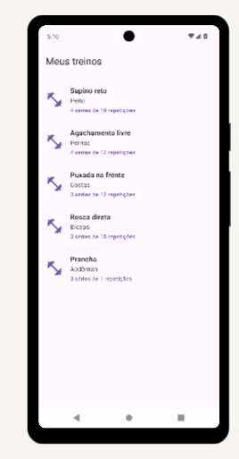
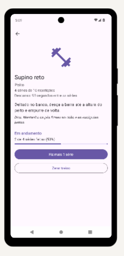

# Treino Fácil

Aplicativo Android para acompanhar os exercícios de um treino de academia.
A lista mostra os exercícios do dia; ao tocar em um deles, o detalhe mostra a descrição, o descanso e uma dica,
e permite marcar quantas séries já foram feitas, com barra de progresso.

Trabalho individual da disciplina AC322A (Programação Mobile), UNAERP — **Parte 1 (Parcial)**.

> **Autor:** Felipe Martins Nascimento — RA 842399

## Telas

Capturas feitas rodando o APK de debug num emulador Android.

| Lista de treinos (tela 1) | Detalhe do treino (tela 2) |
|---|---|
|  |  |

## Objetivo do app

Resolver uma necessidade simples de quem treina: saber, durante o treino, quantas séries de cada exercício
já foram feitas. Nesta etapa os dados são **simulados (mocks)**: não há internet nem banco de dados.

## Como rodar

**Requisitos**

- Android Studio atual (o projeto usa AGP 9.3.1 e Kotlin 2.2.10, as mesmas versões do projeto-base da disciplina).
- JDK 25 (o Android Studio já traz o `jbr-25`; o arquivo `gradle/gradle-daemon-jvm.properties` pede o toolchain 25).
- Aparelho ou emulador com **Android 13 (API 33) ou superior** (`minSdk = 33`).
- Internet na primeira sincronização do Gradle (para baixar as dependências).

**Passos**

1. Clone o repositório e abra a pasta no Android Studio.
2. Aguarde o _Gradle Sync_ terminar.
3. Escolha um emulador ou aparelho e rode a configuração `app`.

Pela linha de comando: `./gradlew assembleDebug`. Testes unitários: `./gradlew testDebugUnitTest`.

**Verificação automática:** o arquivo `.github/workflows/build.yml` faz o GitHub compilar o projeto e rodar os testes
a cada push (aba *Actions*). Um ✔ verde significa que ele compila numa máquina limpa.

**Chaves e senhas:** o app não usa nenhuma, então não há arquivo `.env` para enviar. O `.gitignore` bloqueia
`.env`, keystores e `secrets.properties` por precaução.

## Onde está cada requisito da Parcial

| Requisito | Onde |
|---|---|
| Duas telas em XML | `res/layout/activity_workout_list.xml` e `activity_workout_detail.xml` |
| Views e ViewGroups | `LinearLayout`, `FrameLayout`, `ScrollView`, `RecyclerView`, `TextView`, `ImageView`, `MaterialButton`, `LinearProgressIndicator` |
| Navegação por `Intent` explícita com dados | `WorkoutListActivity.openDetail` envia `EXTRA_WORKOUT_ID` para `WorkoutDetailActivity` |
| ViewBinding | `ActivityWorkoutListBinding`, `ActivityWorkoutDetailBinding`, `ItemWorkoutBinding` |
| Interação que atualiza a interface | botão "Fiz mais 1 série" em `WorkoutDetailActivity` (texto, barra e status mudam) |
| `data class` imutável e campos opcionais | `Workout` (`description`, `restSeconds` e `tip` são `null`áveis) |
| Dados simulados | `WorkoutMockData` em `Workout.kt` |
| Componente XML reutilizável (opcional) | `item_workout.xml`, inflado pelo adapter para cada linha |

Extras: o progresso sobrevive à rotação da tela (`onSaveInstanceState`), tratamento de id inválido na Intent,
botões com área de toque de 48dp e testes unitários dos dados simulados (`app/src/test`).

## Bibliotecas

| Biblioteca | Para que serve |
|---|---|
| AndroidX Core KTX / Activity KTX | extensões Kotlin e `enableEdgeToEdge` |
| AppCompat | `AppCompatActivity` e barra de ferramentas |
| Material Components | tema Material 3, `MaterialToolbar`, `MaterialButton`, `LinearProgressIndicator` |
| RecyclerView (vem junto do Material) | lista de treinos |
| JUnit | testes unitários |

## Estrutura

```
app/src/main/java/com/felipe/treinofacil/
├── Workout.kt                  data class + dados simulados
├── WorkoutListActivity.kt      tela 1 (lista) + adapter
└── WorkoutDetailActivity.kt    tela 2 (detalhe, recebe o id por Intent)
```
